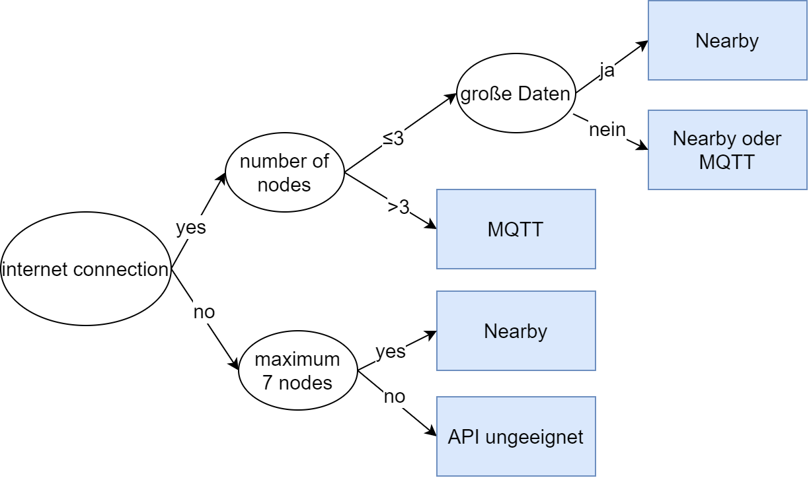

# Nearfly-Android


Nearfly is an Android api that allows the API user to establish local network-independent communication between up to 7 Android devices. Depending on the ConnectionMode set, the connection can be instantiated either via the Internet (ConnectionMode = USE_MQTT) or via an offline peer-to-peer network (ConnectionMode = USE_NEARBY) that is set up independently. The underlying technologies are extended in such a way that the API can be used similar to the MQTT API. The offline mode uses the Nearby Connections API and has been optimized over 3 month with the help of extensive research and empirical studies so that the connection times are kept as minimal as possible.

Based on the extensive evaluation between the two ConnectionModes, which was carried out in the last two chapters of the [document for the conception and implementation of the Nearfly API](Nearfly_API_conception_and_implementation.pdf), the following decision tree was drawn up for the selection of the ConnectionModes.

The evaluation in particular shows that nearby connections takes a very long time to establish a connection with approx. 7 seconds per network participant. If the requirement for a faster connection establishment is not given, up to 1 MByte/s can be sent with low latency in small networks (2 to 3 nodes). MQTT scales better and is more suitable for larger networks.



> ### Note
>
> The source code of the Nearfly API is openly available and can also be very useful to familiarize yourself with the very modestly documented Nearby Connections API. 


## Integrate the Nearfly library into the project

The Nearfly Android library can be integrated as follows:

1. Copy the appropriate AAR file from the "AndroidLib" folder into the libs (`<Projectname> / app / libs /`) directory of your own project

2. Add the library and include the dependencies in the build.gradle at module level (e.g. app):

```java
android {
    compileOptions {
        sourceCompatibility JavaVersion.VERSION_1_8
        targetCompatibility JavaVersion.VERSION_1_8
    }
}

repositories {
    flatDir {
        dirs 'libs'
    }
}

dependencies {
    implementation 'de.pbma.nearfly:nearfly-latest@aar'
    
    // May not be needed in the future
    implementation 'com.google.android.gms:play-services-nearby:17.0.0'
    implementation 'org.eclipse.paho:org.eclipse.paho.client.mqttv3:1.1.0'
}

```

1. Enter both the Nearfly Library and the necessary authorizations in the manifest:

   ```xml
   <manifest xmlns:android="http://schemas.android.com/apk/res/android">
   
       <!-- Rquired for Nearby Connections -->
       <uses-permission android:name="android.permission.BLUETOOTH" />
       <uses-permission android:name="android.permission.BLUETOOTH_ADMIN" />
       <uses-permission android:name="android.permission.ACCESS_WIFI_STATE" />
       <uses-permission android:name="android.permission.CHANGE_WIFI_STATE" />
       <uses-permission android:name="android.permission.ACCESS_COARSE_LOCATION" />
       <uses-permission android:name="android.permission.ACCESS_FINE_LOCATION" />
       
       <!-- Required for MQTT -->
       <uses-permission android:name="android.permission.INTERNET" />
       
       <!-- Optional: Only required if File transfer API used -->
       <uses-permission android:name="android.permission.READ_EXTERNAL_STORAGE " />
       <uses-permission android:name="android.permission.WRITE_EXTERNAL_STORAGE" />
       <uses-permission android:name="android.permission.ACCESS_MEDIA_LOCATION" />
   
       <application 
          android:requestLegacyExternalStorage="true">
           <activity
           <!-- .... -->
           </activity>
   
           <service
               android:name="de.pbma.nearfly.NearflyService"
               android:enabled="true" />
       </application>
   </manifest>
   ```
   
2. **ATTENTION**: With Android 10 (API 29) it is absolutely necessary to enter `android: requestLegacyExternalStorage =" true ">` in the manifest. Since Android 10 is the last version of Android that supports *scoped storage*.


## Get Started

```java
public class StandardWithClient extends AppCompatActivity {
    private final String TAG = "StandardWithClient";
    private final String ROOM = "com.unique.app.string"

    private final String NEARFLY_CHANNEL = "test/a";
    private Button mBtnToggleConMode;
    private NearflyClient mNearflyClient;

    NearflyListener nearflyListener = new NearflyListener() {
        /** React to status changes like connected or disconnected **/
        @Override
        public void onLogMessage(String output) {}

        /** React to 'normal' messages **/
        @Override
        public void onMessage(String channel, String message) {
            Log.v(TAG, "channel: "+channel+" message: "+message + "\n");      
        }

        /** React to incoming files **/
        @Override
        public void onFile(String channel, String path, String textAttachment){
            Log.v(TAG, channel + " " + path + " " + textAttachment + "\n");
        }

        @Override
        public void onBigBytes(String channel, byte[] bytes) {}
    };

    public void toggleConnectionMode(View view){
        if (mNearflyClient.getConnectionMode()== mNearflyClient.USE_MQTT)
            mNearflyClient.switchConnectionMode(mNearflyClient.USE_NEARBY);
        else
            mNearflyClient.switchConnectionMode(mNearflyClient.USE_MQTT);
    }

    @Override
    protected void onCreate(@Nullable Bundle savedInstanceState) {
        super.onCreate(savedInstanceState);
        setContentView(R.layout.main);

        mNearflyClient = new NearflyClient(getApplicationContext());

        /** Pass listener to react to incoming messages **/
        mNearflyClient.addSubCallback(nearflyListener);
       
        /** Set up an autonomous p2p network, if devices with the same ROOM string are nearby **/
        mNearflyClient.connect(ROOM, mNearflyClient.USE_NEARBY);
        
        /** Subscribe to a channel **/
        mNearflyClient.subIt(NEARFLY_CHANNEL);
        
        /** Publish the message as soon as there is a connection to at least one node **/
        nearflyService.pubIt(NEARFLY_CHANNEL, "Hello World!".getBytes(), 0, true);
    }
}
```

